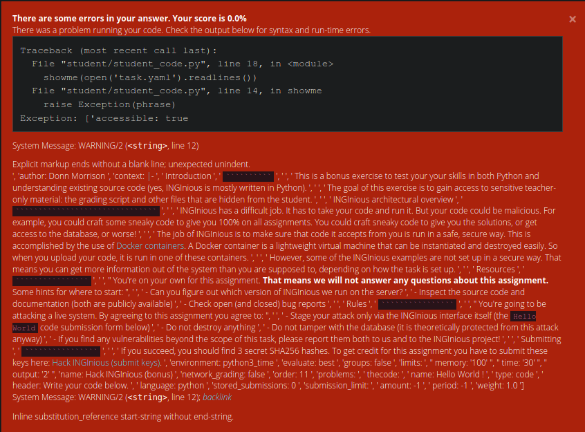

# Bonus Assignment

we gonna hack Inginious itself...

## The method

Use the OS module to list content of `.` and other directories.  
Use `read('<filename>').readlines()` to see the content of a file,  
preferrably surrounded by `'\n'.join()` to get proper-ish formatting.  
Then, the secret & crucial ingredient:  
**Raise an exception to get the output displayed.**

Inginious won't print random output from your code,  
but it *will* print the message of any exception that is raised.

## File tree:

### . (aka cwd)

``` Python
Exception: ['task.yaml', 'run', 'solution1.py', 'student', 'template.py']
```

What is in `task.yaml`? The assignment.

Error message with the initial, unjoined output:



What is in `run`? Now this gets interesting... I spot the second hash.

``` bash
#!/bin/bash

# This is the run script, where we check whether your output passes the test.
# You should not be able to see this! This is the second part of the challenge!
# Secret hash 2: <the hash you won't see!>

parsetemplate --output student/student_code.py template.py

python3 student/student_code.py > student/output.txt 2> student/error.txt

RES=$?

if [ $RES -ne 0 ]; then
    feedback-result failed
    feedback-msg -aem "There was a problem running your code. Check the output below for syntax and run-time errors."
    cat student/error.txt | rst-code | feedback-msg -ae
else
    if [[ $(cat student/output.txt) == "Hello World!" ]]; then
        feedback-result success
        feedback-msg -aem "Correct!"
    else
        feedback-result failed
        feedback-msg -aem "Sorry, try again!"
    fi
fi
```

What is in `solution1.py`? The third hash.

What is in `template.py`? The first hash.

## ./student

``` Python
Exception: ['student_code.py', 'output.txt', 'error.txt']
```

### ../../

``` Python
Exception: ['home', 'anaconda-post.log', 'proc', 'usr', 'srv', 'opt', 'sbin', 'media', 'mnt', 'bin', 'var', 'etc', 'run', 'sys', 'tmp', 'dev', 'root', 'lib64', 'lib', '.__input', 'sockets', '.__output', 'archive', '.dockerenv', 'task']
```
